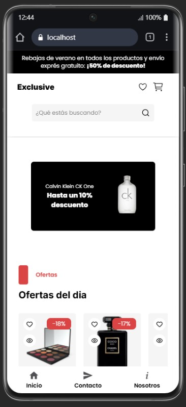
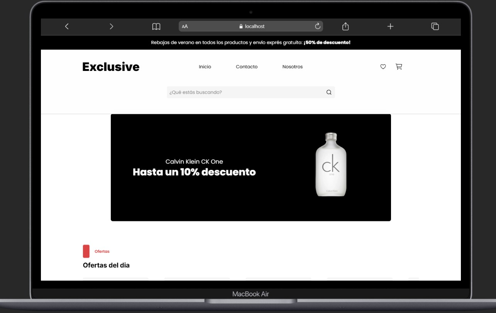

# 🛍️ Exclusive Shop

Tienda online de moda y electrónica desarrollada como proyecto de portfolio. Diseño moderno, responsive y con funcionalidades de e-commerce completas.

🔗 **[Ver demo en vivo](https://exclusive-shop-snowy.vercel.app)**

---

## 📸 Vista previa

---

## ✨ Características

- 🏠 Página de inicio con banner, productos destacados y categorías
- 🛒 Carrito de compras con gestión de productos (añadir, eliminar, actualizar cantidad)
- ❤️ Lista de deseos (wishlist)
- 🔍 Buscador de productos
- 📬 Formulario de contacto con **EmailJS**
- 📱 Diseño totalmente responsive (mobile-first)
- 🎠 Carruseles de productos con **Embla Carousel**
- 🔔 Notificaciones con **React Hot Toast**
- ✅ Validación de formularios con **React Hook Form** + **Zod**

---

## 🛠️ Tecnologías

| Categoría | Tecnología |
|---|---|
| Framework | React 19 |
| Lenguaje | TypeScript |
| Bundler | Vite 5 |
| Estilos | Tailwind CSS 4 |
| Routing | React Router DOM 7 |
| Estado global | Zustand |
| Formularios | React Hook Form + Zod |
| Email | EmailJS |
| Carrusel | Embla Carousel |
| Iconos | Lucide React |
| Fuentes | Poppins / Inter |
| Deploy | Vercel |

---

## 👤 Autor

### Desarrollado con 💕 por <a href='https://portfolio-opal-nine-21.vercel.app/'>Pablo.  </a>
<a href='https://www.linkedin.com/in/pablozalliodev/'>Linkedin -</a>
<a href="mailto:pablozalliodev@gmail.com" target="_blank"> Correo </a>

---

## 📄 Licencia

Este proyecto es de uso libre para fines educativos y de portfolio.

